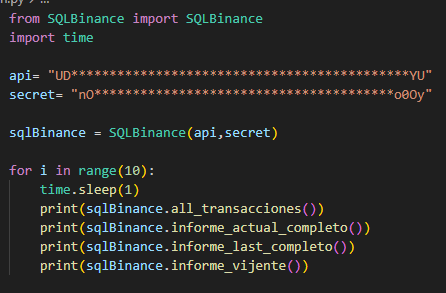
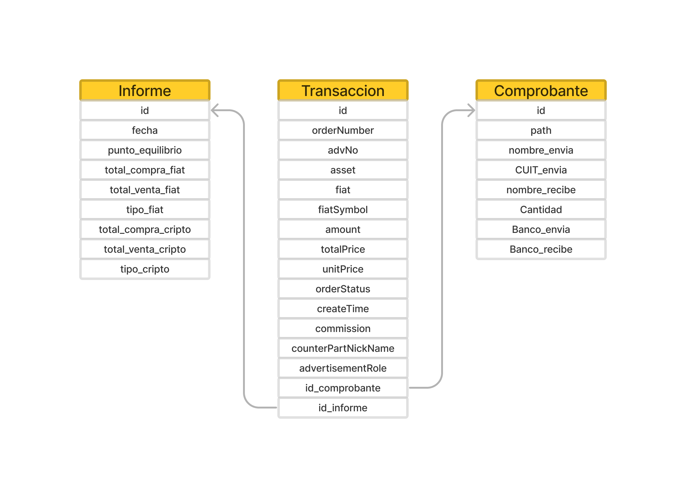

# SQL Binance
Es una librería de python en el cual se toman todos los datos de la API de BINANCE y se lo registra en una base de datos SQLite.

La principal función es registrar los datos y mantenerlos actualizados e íntegros sin tener que crear todas las clases para manejarlos. 

De trasfondo utiliza la librería python-binance. 

Por el momento está en pleno desarrollo y solo tiene funciones para tomar y registrar las operaciones del comercio P2P.

## <h1>¿Para que usarla?</h1>

Si tenes que guardar datos de los mercados de binance o registrar tus movimientos de trading de una forma ligera y rápida, esta es la librería para usted.

No solo se encarga de almacenar todos los datos y mantenerlos actualizados, si no que tambien te deja ver todo en la base.db que crea en tu directorio.

# Forma de Tester

****

**Paso a paso:**

Comienza descargando la librería con:

		pip install SQLBinance

Luego impórtala en tu archivo python con:

		from SQLBinance import SQLBinance

Luego crea una instancia de esta clase y vas a poder acceder a todos los métodos:

		sqlBinance  =  SQLBinance(api,secret)

		for  i  in  range(10):
			time.sleep(1)
			print(sqlBinance.all_transacciones())
			print(sqlBinance.informe_actual_completo())
			print(sqlBinance.informe_last_completo())
			print(sqlBinance.informe_vijente())

Necesitas ponerles las claves API de tu cuenta (Sin permisos, solo lectura)

Si las claves son incorrectas, este da un error

## <h1>Diagrama de relaciones</h1>

Diseñamos un diagrama el cual explica como tratamos la información. La idea es tratar la información de una forma ordenada y metódica, anticiparnos a los posibles errores y ser lo mas eficiente posible.

****

Por el momento solo tenemos estas 3 Clases en la base de datos la cual ejemplifica que:

- Para cada transacción hay un comprobante (Se crea solo cuando se inserta una Transacción a la base)
- Para cada informe, hay un grupo de transacciones.

El informe no es más que un grupo de transacciones que marca cuánto ingreso y cuanto salio. Cuando hay un equilibro entre la compra y venta (En cantidad) Se cierra ese Informe y se crea uno nuevo. 

## <h1>Hilos y código Asincrónico</h1>

Para pedir los datos a Binance, lo hacemos con código asincrónico. 

Es decir, cuando instancias la clase, esta comienza un subproceso el cual pide los datos a binance y los guarda.

Se gestiona automáticamente y trata la mayoría de los errores de conexión. 

Realiza las consultas cada 30 segundos y actualiza la base por completo. 

Apenas comienza es la etapa que mas recursos consume ya que pide y registra todo si la base es nueva, esto puede vuelve la ejecución pesada, pero luego de la primera vuelta la ejecución se vuelve rápida y ligera ya que solo registra lo nuevo.

